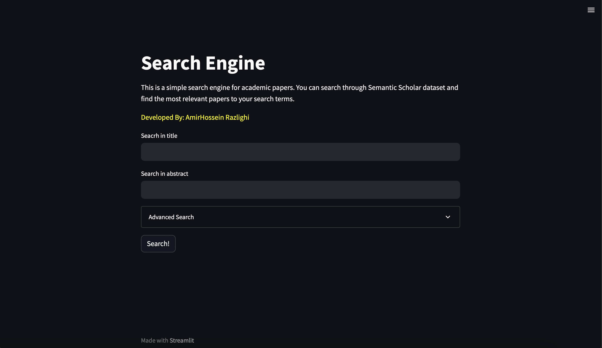
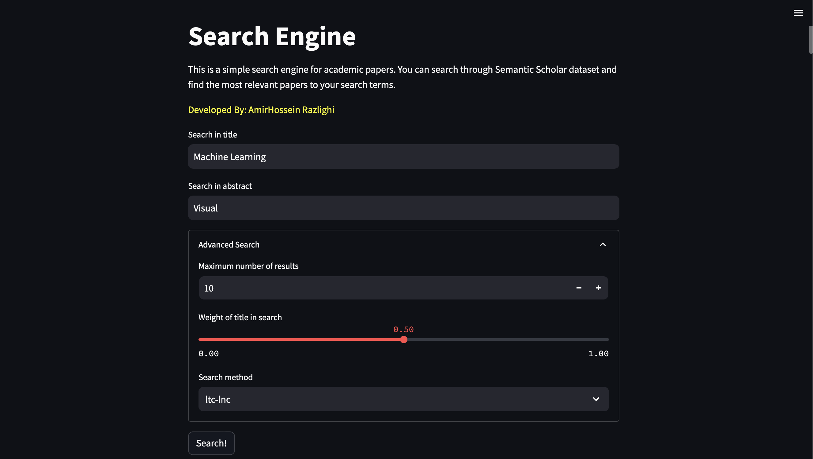
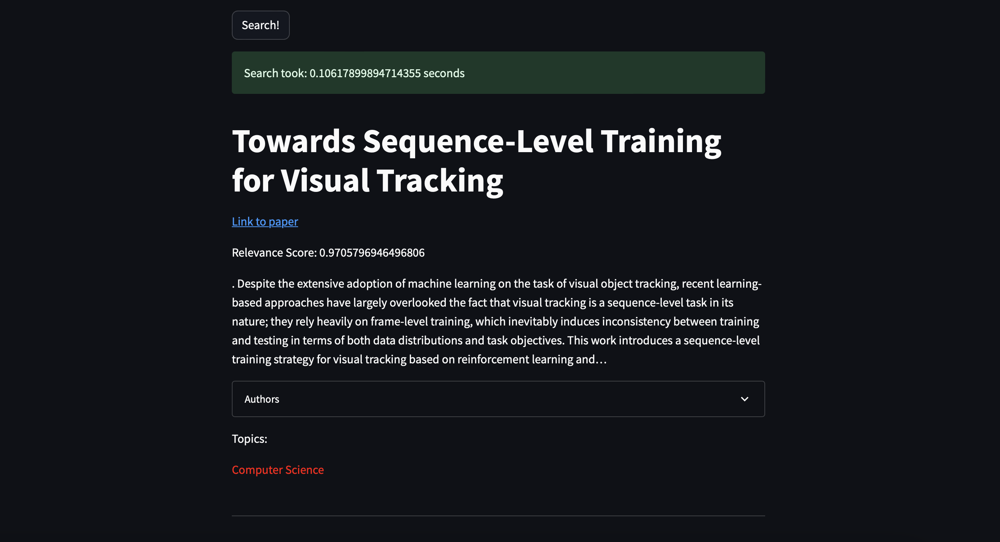

# Semantic Scholar Search Engine

This project is aimed to build a search engine for [Semantic Scholar](https://www.semanticscholar.org/), a free, AI-powered research tool for scientific literature. This search engine is implemented in 3 phases, which you can find the jupyter notebooks in the root of this repository. The first phase aims to build the index, compression of index and doing basic retrieval tasks using TF-IDF.

The second phase aims to do the retrieval tasks using machine learning methods. We investigate *Naive Byaes* Methods alongside *Neural Networks* models and also Language Models to rank the documents. (learning to rank).

The third phase scraps the data from semantic scholar website and classifies that with respect to the author. Then we update the index using this new data and then, we build a frontend system using Streamlit, to make the user experience of the search, easier.

## Requirements
we recommend you to make a virtual environment for this project first, suing this command:
```
python3 -m venv venv
source venv/bin/activate
```

For installing the requirements, you can simply run the following command:

```
pip install -r requirements.txt
```
## How to run the code
You can simply run the codes in the jupyter notebooks to see step-by-step implementations and visualizations of algorithms. Instead, for an easy-to-use UX, you can run the following command:

```
streamlit run frontend_system.py
```

## A glance of the final search engine
You can search through *Title* or *Abstract* of documents, or even customize the algorithm which is used by the system to rank the documents for you! 


The system also uses a spell checker to correct your queries, if you have any typos in your query! This is done using *_bigram index_* and *_edit distance_*. We also recommend you the papers and edit ranking of the documents using *Collaborative Filtering* and *Content Based Recomenndation*.



The results are shown as a list, with their score and also the additional info such as the authors, year of publication and a glance of their abstract (and of course, link to the paper!) and its related topics.

